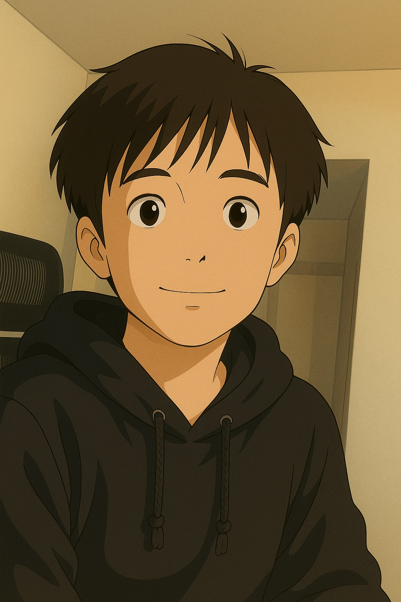

# Chencheng's User Page

> **Note:** This project is part of my CSE 110 coursework at UC San Diego. Here is the URL to the publish site: <https://chencheng-li.github.io/CSE110_Lab1/>

## About Me



> Here is the [download link](assets/selfie.jpeg) to my selfie — you’re welcome.

Hi! I'm **Chencheng Li**, an undergraduate Computer Science student at UC San Diego. I'm passionate about AI, software engineering, and building meaningful projects. I enjoy exploring the intersection of creativity and technology, and I'm currently working on research and development projects related to vision-language models and procedural generation.

- 📚 Current Courses: CSE 110 (Software Engineering), [CSE 152B](https://cseweb.ucsd.edu/~mkchandraker/classes/CSE152B/Spring2025/) (Computer Vision), MATH 183 (Statistics)
- 💼 Projects: SceneProg, ERSP, vision-language model annotation, and more
- 🌱 Learning Goals: Deepen my understanding of deep learning, RL, and computer vision

### Fan Fact

1. 🎮 Fun Fact 1: I like playing Stardew Valley and optimizing my farm's layout!
2. 🧑‍💻 Fun Fact 2: My favorite language is Python

> Here's how I usually start a simple Python script:

```python
if __name__ == "__main__":
    print("Welcome to Chencheng's project!")
```


Let's build cool things together!

> "Any fool can write code that a computer can understand. Good programmers write code that humans can understand."  
> — Martin Fowler


If you still don't know about me? [Jump to](#about-me)

## Roadmap

- [ ] TBD
=======
Note: This project is part of my CSE 110 coursework at UC San Diego. Here is the URL to the publish site: <https://chencheng-li.github.io/CSE110_Lab1/>

